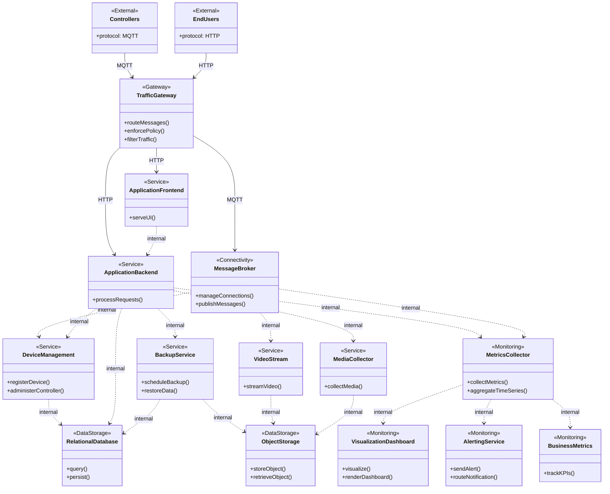
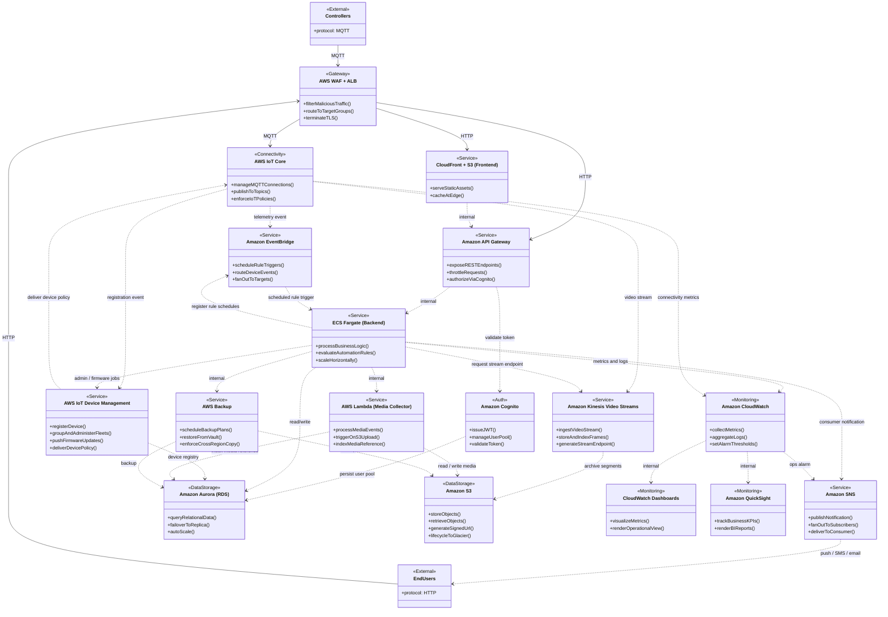

---

## Service Descriptions and Responsibilities

### Gateway Layer

**Traffic Gateway** is the single ingress point for all external communication entering the system. It combines the responsibilities of a load balancer and a web application firewall, receiving both MQTT traffic from device controllers and HTTP traffic from end users. Its primary duties are traffic filtering — rejecting malformed, abusive, or policy-violating requests before they reach internal services — and protocol-aware routing, directing device messages toward the message broker and user-facing requests toward the frontend and backend services. By consolidating these concerns at a single boundary, the rest of the internal architecture can operate without exposure to the public internet and without duplicating security enforcement across individual services.

### Connectivity Layer

**Message Broker** manages the persistent, bidirectional messaging connections between device controllers and the internal service layer. It implements the publish-subscribe model over MQTT, maintaining topic hierarchies that separate command channels, telemetry streams, and status broadcasts. Controllers publish state updates and event notifications to designated topics, while internal services subscribe to receive that data and may publish command messages back to specific device topics. The broker is responsible for enforcing connection authentication and topic-level access policies, ensuring that no controller can read or write to topics belonging to another household. It feeds device events downstream to the Device Management service and routes media streams to the Video Stream service.

### Application Services

**Application Frontend** delivers the user interface to end users over HTTP. It is responsible for serving the client-side application — composed of static assets such as HTML, JavaScript, and stylesheets — and directing dynamic data requests to the Application Backend via the internal network. The frontend is intentionally stateless, holding no business logic or persistent state of its own, which allows it to be cached and distributed geographically to reduce latency for users regardless of their physical location.

**Application Backend** contains the core business logic of the system and acts as the authoritative coordinator for all user-initiated operations. It processes authenticated API requests forwarded from the frontend, enforces authorization rules, manages user accounts and household configurations, evaluates automation rules, and orchestrates calls to the Device Management, Media Collector, and Backup services. The backend is also the primary emitter of operational metrics to the monitoring layer, making it the component with the broadest visibility into system behavior at runtime.

**Device Management** maintains the authoritative registry of all controllers enrolled in the system. It handles the lifecycle of individual devices from initial registration through ongoing configuration and decommissioning. Device Management receives real-time connection and state events from the Message Broker and persists device identity, configuration, and status to the Relational Database. It also serves as the channel through which the backend issues administrative operations to specific devices, such as remote configuration changes or scheduled firmware update directives.

**Video Stream** is responsible for receiving and durably storing continuous video data pushed from camera-equipped controllers via the Message Broker. It manages the ingestion pipeline for time-series video data, indexing frames and segments in a way that supports both real-time playback and historical retrieval. Processed and archived video segments are written to Object Storage, where they can be retrieved on demand by end users or consumed by downstream media processing workflows.

**Media Collector** handles event-driven processing of media artifacts as they are produced by the system. Rather than operating on a continuous stream, it responds to discrete events — such as the arrival of a new image, clip, or audio segment in Object Storage — and performs secondary operations including metadata extraction, thumbnail generation, and database indexing. This separation of concerns keeps the Video Stream service focused on ingestion throughput while delegating post-processing to a dedicated, independently scalable component.

**Backup Service** enforces data redundancy across the system's storage layer according to a defined retention and recovery policy. It coordinates scheduled backups of both the Relational Database and Object Storage, manages backup vault destinations, and provides the restore path in the event of data loss or corruption. By centralizing backup scheduling and policy enforcement in a dedicated service, the system avoids fragmented, per-component backup logic and ensures that recovery point objectives are consistently applied across all data stores.

### Data Storage

**Relational Database** stores all structured, relational data in the system, including user accounts, household profiles, device registrations, automation rule definitions, and event audit logs. Its relational schema enforces referential integrity between entities — for example, ensuring that a device record cannot exist without a valid household association — and supports the transactional operations required when users modify configurations or rules. The database is the source of truth for all persistent application state that is not media or telemetry in nature.

**Object Storage** holds all unstructured and binary data in the system, including video segments, media thumbnails, backup archives, and static frontend assets. It is optimized for high-durability, high-throughput storage of large objects and is designed to be accessed by multiple services concurrently without coordination overhead. Lifecycle policies applied at the storage layer can automatically transition objects to lower-cost archival tiers as they age, reducing long-term storage costs without requiring application-level data management logic.

### Monitoring and Observability

**Metrics Collector** aggregates time-series metrics and log data emitted by all internal services and infrastructure components. It provides the foundation for the observability layer by continuously scraping or receiving telemetry from the Application Backend, Message Broker, and other services, normalizing that data into a queryable format, and evaluating it against defined thresholds to determine when alert conditions have been met. All downstream monitoring components — dashboards, alerting, and business analytics — consume data that has been processed and stored by the Metrics Collector.

**Visualization Dashboard** renders the operational metrics collected from the system into human-readable graphical panels intended for engineering and operations teams. It supports real-time and historical views of service health, resource utilization, error rates, and throughput, enabling teams to identify performance trends and diagnose incidents. Dashboards are organized by service boundary and by system-wide health, and they draw exclusively from data already present in the Metrics Collector rather than querying production services directly.

**Alerting Service** receives threshold breach notifications from the Metrics Collector and routes them to the appropriate on-call channels or automated remediation workflows. It decouples the definition of alert conditions — which lives in the Metrics Collector — from the definition of notification targets, allowing notification routing to be reconfigured independently of monitoring rules. Alerts may be delivered via email, SMS, webhook, or integrated incident management platforms depending on the severity and classification of the triggering condition.

**Business Metrics** provides a business-intelligence view of the platform's operational data, oriented toward product and stakeholder audiences rather than engineering teams. It connects to the relational and metrics data sources to surface key performance indicators such as active device counts, user engagement rates, automation rule execution frequency, and system availability over rolling time windows. Unlike the operational dashboard, which emphasizes real-time system health, the business metrics component is designed for trend analysis and strategic decision-making.

---

## Proposed AWS Service Architecture

---

## AWS Service Descriptions and Responsibilities

### Gateway Layer

**AWS WAF + Application Load Balancer (ALB)** serves as the single entry point for all external traffic entering the system. The Web Application Firewall inspects inbound requests against managed rule sets to block common exploits such as SQL injection, cross-site scripting, and volumetric abuse before they reach any internal service. The Application Load Balancer sits behind the WAF and is responsible for TLS termination, protocol routing, and distributing requests across healthy target groups. MQTT traffic originating from device controllers is directed toward AWS IoT Core, while HTTP traffic from end users is split between the CloudFront-hosted frontend and the API Gateway, depending on the nature of the request. This layer ensures that no component in the internal infrastructure is directly reachable from the public internet.

### Connectivity Layer

**AWS IoT Core** acts as the managed MQTT broker that maintains persistent, authenticated connections with all registered device controllers. It enforces per-device IoT policies that govern which topics a device may publish to or subscribe from, preventing cross-device interference or unauthorized command injection. IoT Core forwards device registration events to IoT Device Management, routes incoming video streams to Kinesis Video Streams, and publishes telemetry events to EventBridge for rule evaluation — allowing device-sourced data to fan out to the appropriate downstream service without coupling the broker to individual consumer logic.

### Application Services

**Amazon CloudFront + S3 (Frontend)** delivers the user-facing web application as a set of static assets cached at AWS edge locations globally. CloudFront reduces latency for geographically distributed users and offloads origin traffic from the backend, while S3 provides durable, low-cost object hosting for the compiled frontend bundle. Dynamic API calls made by the frontend are forwarded through CloudFront to API Gateway rather than being handled at the edge.

**Amazon Cognito** provides the user identity and authentication layer for the platform. It manages the consumer user pool — handling account creation, credential storage, password policies, and multi-factor authentication — and issues signed JWT tokens upon successful login. API Gateway validates these tokens on every inbound request before forwarding traffic to the backend, ensuring that unauthenticated sessions cannot reach any protected resource. Cognito also supports the invitation-based account linking flow required by the access delegation use case, where a secondary user accepts an invitation and either creates a new account or links an existing one to the inviting household.

**Amazon API Gateway** exposes the REST interface consumed by both the frontend application and any authorized third-party integrations. It handles request throttling, usage plan enforcement, and token validation via Amazon Cognito, ensuring that only authenticated sessions can invoke backend operations. API Gateway acts as the protocol boundary between HTTP clients and the ECS-hosted backend services, and it offloads cross-cutting concerns — authentication, rate limiting, and CORS — from the backend entirely.

**ECS Fargate (Backend)** runs the core application logic as containerized workloads without requiring management of the underlying compute infrastructure. Fargate tasks handle business operations including user account management, automation rule processing, device command dispatch, and orchestration of calls to downstream services. The backend is also responsible for registering rule-based schedules with EventBridge and for dispatching consumer-facing notifications through SNS in response to device events and household management operations such as access delegation invitations. Because Fargate scales task count independently of server provisioning, the backend can absorb traffic spikes driven by consumer growth without manual intervention.

**Amazon EventBridge** serves as the scheduling and event-routing backbone for the automation rules engine. When a Consumer defines a time-based automation rule, the backend registers a corresponding EventBridge schedule that fires at the specified cadence and invokes the backend rule evaluator as the target. EventBridge also receives device telemetry events forwarded from IoT Core and routes them to the appropriate backend handler for rule condition evaluation, decoupling the IoT message pipeline from direct backend invocations and enabling fan-out to multiple consumers of the same event stream.

**AWS IoT Device Management** provides the administrative plane for the controller fleet. It maintains the device registry, supports grouping of controllers by household or region, and serves as the channel through which over-the-air configuration and firmware update jobs are issued. Upon receiving a registration event from IoT Core, Device Management assigns the device an identity, associates it with the correct household record in Aurora, and then publishes the applicable device policy back through IoT Core so the controller begins operating within its authorized topic scope. This bidirectional relationship with IoT Core is what closes the registration handshake described in UC-04.

**Amazon Kinesis Video Streams** ingests, durably stores, and indexes live video data pushed from camera-equipped controllers via IoT Core. It handles the time-series nature of video data and exposes APIs for both real-time playback and historical retrieval — the backend queries Kinesis Video Streams directly when a Consumer requests a live stream endpoint, receiving a time-limited URL that the frontend uses to initiate playback. Processed frames and media segments are ultimately archived to S3, where lifecycle policies can transition older footage to lower-cost storage tiers automatically.

**AWS Lambda (Media Collector)** provides event-driven processing of media artifacts as they arrive in S3. Lambda functions are triggered by S3 object creation events and are responsible for tasks such as thumbnail generation, metadata extraction, and transcoding. Critically, the Media Collector also writes media reference records — including S3 object keys, timestamps, and associated device identifiers — back to Aurora so that the historical event review use case can surface media clips alongside event log entries without requiring a direct scan of S3. Because Lambda scales to zero when idle, this component adds no standing cost during periods without media activity.

**AWS Backup** enforces a centralized, policy-driven backup strategy across both Aurora and S3. Backup plans define retention schedules, vault destinations, and cross-region copy rules, ensuring that recovery point objectives are met without relying on ad hoc scripting. In the event of data loss or corruption, AWS Backup provides a consistent restore path for both structured relational data and unstructured object data.

### Data Storage

**Amazon Aurora (RDS)** stores all structured relational data for the system, including user accounts, household configurations, device registrations, automation rules, and audit logs. Aurora provides MySQL or PostgreSQL compatibility with a storage layer that automatically replicates across multiple Availability Zones and supports read replicas for query offloading. Its serverless scaling variant can also be considered to match compute capacity to actual query load during periods of low activity.

**Amazon S3** serves as the primary object store for all unstructured and semi-structured data, including video segments, media thumbnails, database backup archives, and frontend static assets. S3's lifecycle policies allow objects to transition automatically from standard storage to infrequent-access or Glacier tiers as they age, optimizing storage costs without requiring application-level logic to manage data tiering.

### Monitoring and Observability

**Amazon CloudWatch** is the central observability service that collects metrics, logs, and traces from all internal components. ECS task metrics, IoT Core connection counts, Lambda invocation statistics, and Aurora performance data are all streamed to CloudWatch, providing a unified view of system health. CloudWatch Alarms evaluate metric thresholds and act as the trigger mechanism for automated responses and notifications.

**CloudWatch Dashboards** render the operational metrics collected by CloudWatch into visual panels accessible to engineering and operations teams. Dashboards can be scoped to individual services or composed into system-wide views, enabling teams to identify trends and anomalies during both normal operation and incident response.

**Amazon SNS** serves a dual notification role in the system. For consumer-facing use cases — event alerts, automation triggers, and access delegation invitations — the backend publishes directly to SNS topics scoped to individual households, which fan out to each Consumer's registered endpoints such as push notification tokens, SMS numbers, or email addresses. For operational use cases, CloudWatch Alarms publish to separate SNS topics that target the engineering on-call rotation via PagerDuty webhooks or similar integrations. Separating consumer and operational topic namespaces prevents alarm noise from reaching end users and ensures that consumer notification volume does not interfere with operational alerting reliability.

**Amazon QuickSight** connects to Aurora and CloudWatch data sources to produce business intelligence dashboards tracking key performance indicators such as active device counts, user engagement metrics, rule execution frequency, and system availability over time. QuickSight is intended for stakeholders and product teams rather than operations engineers, providing a business-level view of the platform's health and growth.
