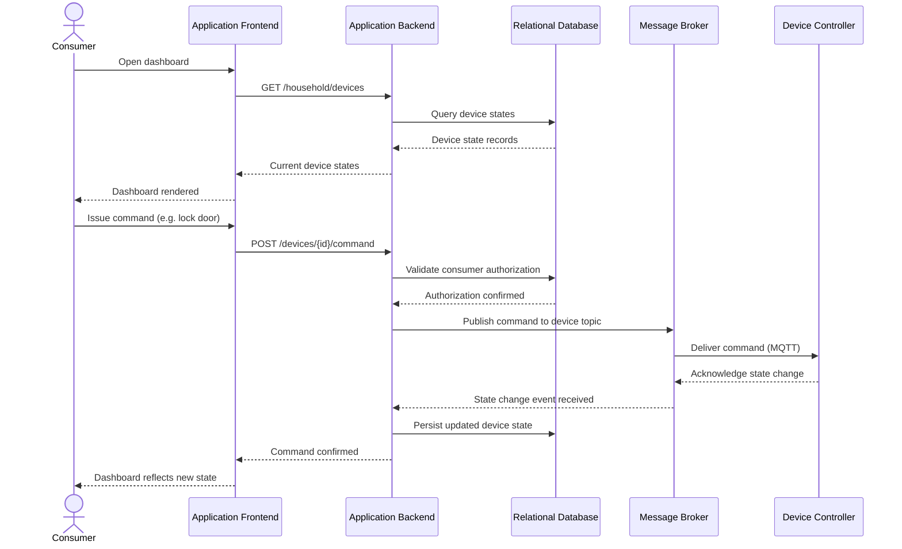
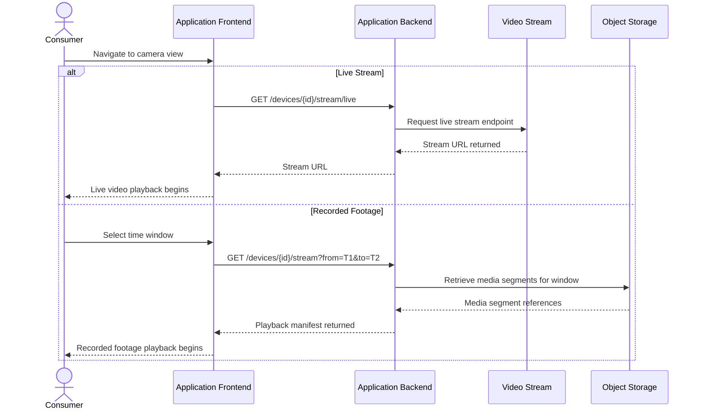
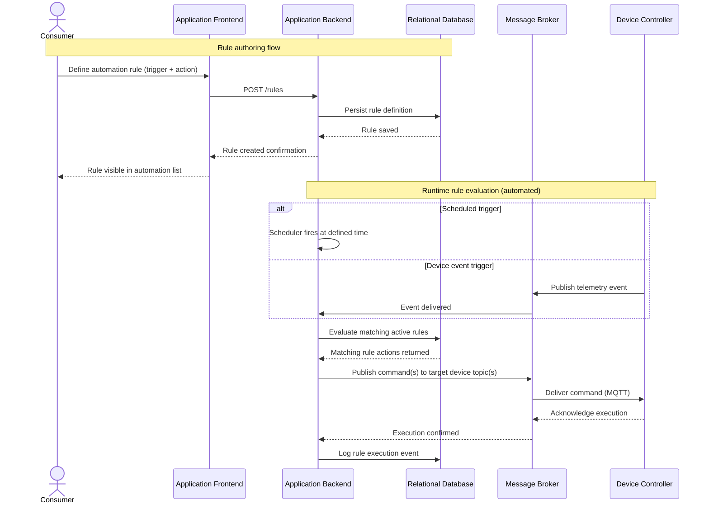
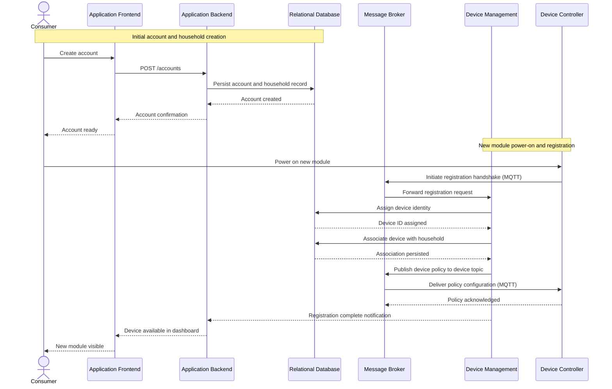
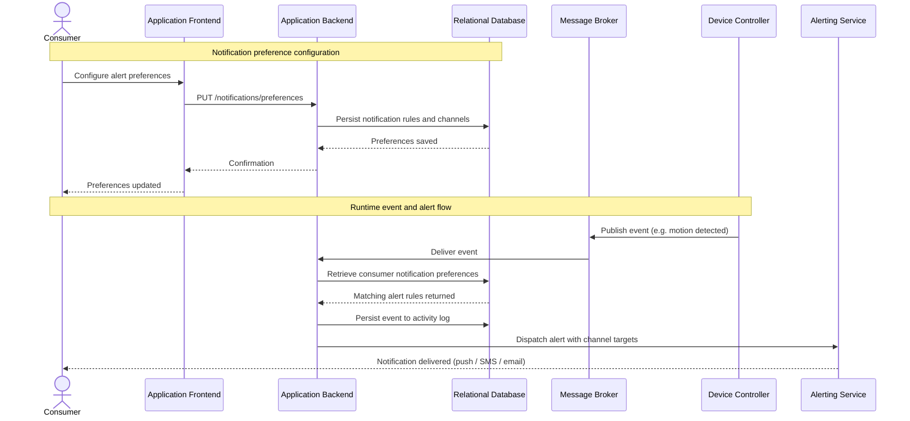
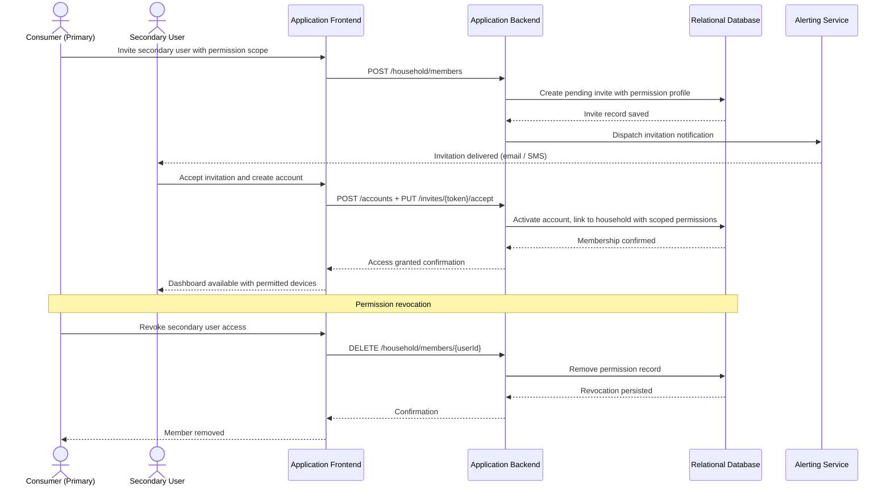
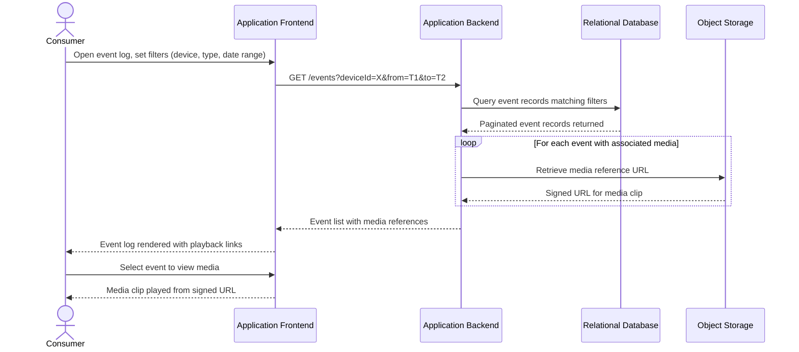
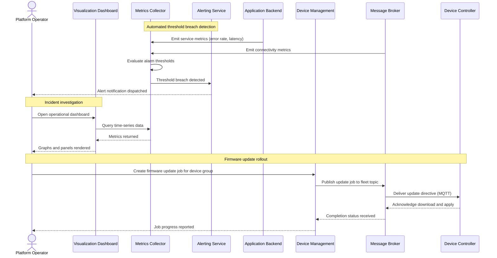

# Use Cases and Actors

## Actors

The system involves three distinct categories of actors whose interactions shape the functional requirements of the architecture. The primary actor is the **Consumer**, a homeowner or member of a small family household who has purchased one or more modular units and interacts with the system through a web or mobile frontend, both locally and remotely over the internet. The Consumer is assumed to be a non-technical end user who expects a turnkey experience with minimal configuration burden. The secondary actor is the **Device Controller**, a hardware module — such as a smart lock, light switch, camera, or thermostat — that communicates with the cloud platform autonomously via the specified software protocol over the household's existing WiFi connection. Device Controllers are not operated by humans in real time; rather, they publish state changes and respond to commands issued by the platform. The tertiary actor is the **Platform Operator**, representing the engineering and operations staff of the home electronics company who are responsible for maintaining the health of the cloud infrastructure, deploying updates, and monitoring system-wide behavior across all customer households.

---

## Use Cases

### UC-01: Remote Device Control

A Consumer wishes to control a module — such as turning off a light or locking a front door — while away from home. The Consumer opens the frontend application, authenticates, and is presented with a dashboard reflecting the current state of all registered modules in their household. The Consumer selects a module and issues a command. The backend validates the request against the Consumer's authorization profile, routes the command to the appropriate Device Controller via the Message Broker, and confirms execution once the controller acknowledges the state change. The updated state is reflected in the dashboard in near-real time. This use case represents the most frequent interaction pattern and drives the core latency and availability requirements of the platform.

### UC-02: Remote Camera Monitoring

A Consumer wishes to observe their home remotely via a camera module. The Consumer navigates to the camera view in the frontend application and requests either a live stream or a recording from a specified time window. The backend retrieves the appropriate stream endpoint or historical media segment from the Video Stream service and Object Storage, respectively, and returns a playback-ready resource to the frontend. The Consumer can view continuous footage or seek through archived recordings. This use case drives the media ingestion, storage, and retrieval requirements of the architecture and informs the bandwidth and data retention policies applied to Object Storage.

### UC-03: Automation Rule Programming

A Consumer wishes to define a rule that automates device behavior without manual intervention — for example, locking all doors at 10:00 PM nightly, or turning on hallway lights when a motion sensor detects activity after sunset. The Consumer accesses the automation rules interface in the frontend, defines trigger conditions and target actions, and saves the rule. The backend persists the rule definition to the Relational Database and registers it with the rule evaluation engine. At runtime, the backend evaluates active rules against incoming device telemetry and scheduled triggers, and dispatches commands to the appropriate Device Controllers when conditions are met. This use case requires the platform to support a flexible, user-defined logic model and reliable scheduled execution independent of whether the Consumer is actively using the application.

### UC-04: Device Registration and Household Setup

A Consumer purchases a new module and needs to associate it with their household account so that it appears in the dashboard and can be controlled or incorporated into automation rules. The Consumer powers on the module, which connects to the household WiFi and initiates a registration handshake with the platform via the Message Broker. The backend, through the Device Management service, assigns the module a unique identity, associates it with the Consumer's household, and applies the default policy configuration for that device type. The module is then available in the Consumer's dashboard. This use case also covers the initial household onboarding flow when a Consumer sets up the system for the first time, including account creation and WiFi credential provisioning.

### UC-05: Event Notification and Alerting

A Consumer wishes to receive immediate notification when a significant event occurs at their home — such as a door being opened unexpectedly, a motion detection trigger, or a sensor crossing a threshold. The Consumer configures notification preferences in the frontend, selecting which event types and which modules should trigger alerts and specifying delivery channels such as push notification, SMS, or email. When a Device Controller publishes a qualifying event to the Message Broker, the backend evaluates the event against the Consumer's notification configuration and dispatches an alert through the appropriate channel. This use case requires low-latency event propagation from the device layer through the platform to the Consumer, and informs the reliability requirements of the message pipeline.

### UC-06: Access Delegation

A Consumer wishes to grant another member of their household — such as a spouse or older child — the ability to control specific modules or view certain camera feeds without granting full administrative access to the account. The Consumer navigates to the access management section of the frontend and invites the secondary user by email or phone number, assigning a permission profile that scopes their access to designated modules and operations. The secondary user receives an invitation, creates or links an account, and thereafter interacts with the system within the boundaries set by the primary Consumer. This use case requires the backend authorization model to support per-module, per-user permission grants that can be modified or revoked by the primary account holder at any time.

### UC-07: Historical Event and Activity Review

A Consumer wishes to review past activity for their household — for example, checking what time a door was unlocked on a given day, or reviewing a motion event that triggered an alert overnight. The Consumer accesses the event log in the frontend and queries by device, event type, or date range. The backend retrieves the relevant records from the Relational Database and, where applicable, surfaces associated media clips from Object Storage. This use case drives the data retention and indexing requirements of the storage layer, as Consumers expect to query event history spanning days to months with acceptable response times.

### UC-08: Platform Operations and Fleet Monitoring

A Platform Operator monitors the health of the cloud infrastructure and the device fleet across all deployed households. The operator accesses internal dashboards provided by the Visualization Dashboard and Business Metrics components to observe service error rates, message throughput, device connectivity statistics, and key business indicators such as active household counts and module type distribution. When a threshold breach occurs — such as an elevated rate of failed device connections — the Alerting Service notifies the on-call operator, who investigates and remediates. This use case also covers the deployment of software updates to the platform services and the issuance of firmware update jobs to Device Controllers through the Device Management service.

---

## Sequence Diagrams

### UC-01: Remote Device Control

### UC-02: Remote Camera Monitoring

### UC-03: Automation Rule Programming

### UC-04: Device Registration and Household Setup

### UC-05: Event Notification and Alerting

### UC-06: Access Delegation

### UC-07: Historical Event and Activity Review

### UC-08: Platform Operations and Fleet Monitoring

