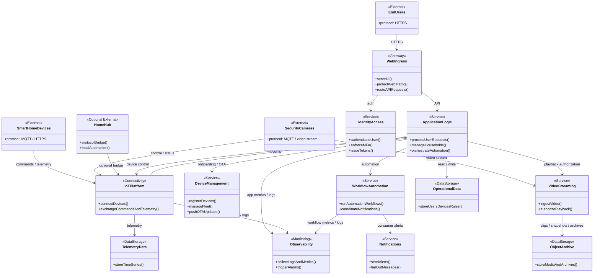

---

## Service Descriptions and Responsibilities

### External Actors

**End Users** interact with the platform through a consumer-facing web or mobile application over HTTPS. They authenticate, onboard household members, configure devices, view status, define automations, receive notifications, and initiate remote control actions.

**Smart Home Devices** represent modular devices such as locks, lights, thermostats, and sensors. These devices exchange commands, status updates, and telemetry with the platform using device-oriented protocols such as MQTT or HTTPS.

**Security Cameras** are modeled separately from other modules because they produce both normal IoT control/status traffic and continuous media traffic. Camera control and status follow the normal IoT path, while video is streamed through a dedicated media service.

**Home Hub** is optional and represents a local gateway or protocol bridge in the home. It can simplify onboarding of heterogeneous modules and support limited local coordination, but it is not required for the core cloud architecture.

### Gateway and User Access Layer

**Web Ingress** represents the public user-facing entry path for the application. At a high level, it is responsible for content delivery, web application protection, and routing API traffic toward backend services. This keeps the platform's user-facing concerns separate from the device-facing connectivity path.

**Identity Access** handles consumer authentication and authorization. It is responsible for validating user credentials, enforcing strong authentication such as MFA, and issuing the access tokens used to authorize requests into the application APIs.

### Core Application and Device Services

**Application Logic** contains the core business behavior of the platform. It processes API requests, manages users and households, coordinates device control requests, persists operational state, and invokes automation or notification workflows as needed. It is the primary bridge between the user/control plane and the device/data plane.

**IoT Platform** provides managed device connectivity for the modular smart-home fleet. It handles device connections, authenticated message exchange, command delivery, and ingestion of telemetry or status events. This is the main device-facing entry point for non-video module interactions.

**Device Management** provides fleet onboarding and lifecycle capabilities. It supports registration of new modules, organization of device fleets, and over-the-air updates for hubs and compatible devices. This directly addresses the requirement for automated device discovery/registration and maintainable device lifecycle operations.

**Video Streaming** is the dedicated media path for security cameras. It receives video from cameras, supports controlled playback access for end users, and separates media transport from the normal IoT messaging path. This keeps the architecture realistic for live or near-real-time camera viewing.

**Workflow Automation** coordinates multi-step user-defined automations and event-driven workflows. It is invoked when simple request/response processing is insufficient, such as when a device event should trigger additional actions, notifications, or scheduled rule execution.

**Notifications** provides fan-out delivery of consumer-facing alerts such as motion notifications, automation triggers, or device status issues. It is intentionally separated from core application logic so notification delivery can scale independently.

### Data and Observability Layer

**Operational Data** stores persistent business and configuration data such as users, households, device inventory, and automation rule definitions. This store is the source of truth for the platform's administrative and control-plane state.

**TelemetryData** stores time-series sensor and telemetry information emitted by connected modules. It is optimized for historical analysis, dashboards, and trend-oriented queries rather than transactional configuration data.

**ObjectArchive** stores clips, snapshots, media artifacts, and long-retention archival data. It is the appropriate storage target for large unstructured objects rather than operational metadata.

**Observability** centralizes platform logs, metrics, dashboards, and alarms. It supports operations by exposing service health, device connectivity trends, workflow failures, and notification issues in a unified manner.

---

## Proposed AWS Service Architecture

```mermaid
classDiagram
    class EndUsers {
        <<External>>
        +protocol: HTTPS
    }
    class SmartHomeDevices {
        <<External>>
        +protocol: MQTT / HTTPS
    }
    class SecurityCameras {
        <<External>>
        +protocol: MQTT + video stream
    }
    class HomeHub {
        <<Optional External>>
        +protocolBridge()
    }
    class CloudFront {
        <<Gateway>>
        +deliverFrontend()
        +cacheAtEdge()
    }
    class WAF {
        <<Gateway>>
        +filterWebTraffic()
        +enforceWebRules()
    }
    class APIGateway["Amazon API Gateway"] {
        <<Service>>
        +exposeAPIs()
        +authorizeRequests()
        +throttleTraffic()
    }
    class Cognito["Amazon Cognito"] {
        <<Auth>>
        +manageUsers()
        +enforceMFA()
        +issueTokens()
    }
    class Lambda["AWS Lambda"] {
        <<Service>>
        +processBusinessLogic()
        +handleDeviceControl()
        +authorizePlayback()
    }
    class IoTCore["AWS IoT Core"] {
        <<Connectivity>>
        +connectDevices()
        +ingestTelemetry()
        +routeCommands()
    }
    class IoTDeviceMgmt["AWS IoT Device Management"] {
        <<Service>>
        +registerDevices()
        +groupFleets()
        +manageOTAUpdates()
    }
    class StepFunctions["AWS Step Functions"] {
        <<Service>>
        +orchestrateWorkflows()
        +runAutomations()
    }
    class SNS["Amazon SNS"] {
        <<Service>>
        +publishNotifications()
        +fanOutAlerts()
    }
    class KVS["Amazon Kinesis Video Streams"] {
        <<Service>>
        +ingestVideo()
        +providePlaybackSessions()
    }
    class DynamoDB["Amazon DynamoDB"] {
        <<DataStorage>>
        +storeOperationalState()
        +readWriteMetadata()
    }
    class Timestream["Amazon Timestream"] {
        <<DataStorage>>
        +storeTelemetry()
        +queryTimeSeries()
    }
    class S3["Amazon S3"] {
        <<DataStorage>>
        +storeObjects()
        +archiveMedia()
    }
    class CloudWatch["Amazon CloudWatch"] {
        <<Monitoring>>
        +collectMetricsAndLogs()
        +raiseAlarms()
    }

    EndUsers --> CloudFront : access app
    CloudFront --> WAF : protected web traffic
    WAF --> APIGateway : API traffic
    APIGateway ..> Cognito : validate token
    APIGateway --> Lambda : invoke backend

    Lambda <..> DynamoDB : read / write users, devices, rules
    Lambda <..> IoTCore : command / status interactions
    Lambda --> IoTDeviceMgmt : onboarding / OTA operations
    Lambda --> StepFunctions : start workflows
    StepFunctions --> SNS : consumer notifications

    SmartHomeDevices --> IoTCore : commands / telemetry
    HomeHub --> IoTCore : optional bridge
    IoTCore --> Timestream : telemetry history
    IoTCore --> Lambda : device events
    IoTCore --> CloudWatch : connectivity metrics / logs

    SecurityCameras --> IoTCore : control / status
    SecurityCameras --> KVS : video stream
    Lambda --> KVS : playback authorization
    KVS --> S3 : clips / snapshots / archive

    APIGateway --> CloudWatch : API metrics / logs
    Lambda --> CloudWatch : function metrics / logs
    StepFunctions --> CloudWatch : workflow metrics / logs
    KVS --> CloudWatch : stream metrics / logs
    CloudWatch --> SNS : operational alarms
```

---

## AWS Service Descriptions and Responsibilities

### User Access and API Layer

**Amazon CloudFront** delivers the user-facing application and acts as the edge entry point for the web experience. It improves responsiveness for remote users by caching static frontend assets closer to consumers.

**AWS WAF** protects the public web/API surface by filtering malicious or abusive HTTP traffic before it reaches backend APIs. At this level of abstraction, it represents web application protection for the user-facing path rather than the device path.

**Amazon API Gateway** exposes the platform's HTTPS APIs to the web or mobile client. It provides the controlled API boundary through which the frontend invokes backend logic for setup, monitoring, control, and automation management.

**Amazon Cognito** provides user authentication and authorization for consumers. It manages user sign-in and MFA and supplies tokens used to secure remote access attempts.

### Core Platform Services

**AWS Lambda** implements the main application logic. It processes user-initiated actions, coordinates device control, authorizes access to camera playback, and persists or retrieves operational state from managed data stores.

**AWS IoT Core** is the managed entry point for smart-home devices. It handles authenticated device connectivity, exchanges command and telemetry messages, and serves as the core device-facing service for modular controllers.

**AWS IoT Device Management** handles device onboarding, fleet organization, and over-the-air updates. It gives the architecture a clear answer for initial registration and long-term lifecycle management without forcing those concerns into the main application service.

**AWS Step Functions** orchestrates multi-step automations and workflows. It is the high-level automation backbone for event-driven behaviors that require more than a single synchronous request.

**Amazon SNS** delivers fan-out notifications to end users and also supports operational alert delivery when invoked by monitoring services.

**Amazon Kinesis Video Streams** provides the dedicated media ingestion and playback path for security cameras. It separates real-time or near-real-time video handling from the general-purpose IoT messaging path.

### Data and Monitoring Services

**Amazon DynamoDB** stores operational application data such as users, households, registered devices, and automation definitions. It supports the platform's control-plane state and device metadata needs.

**Amazon Timestream** stores telemetry and sensor history for modules that emit time-series data. It is intended for historical querying and trend analysis rather than general application state.

**Amazon S3** stores large unstructured artifacts such as camera clips, snapshots, and longer-term archives.

**Amazon CloudWatch** centralizes metrics, logs, dashboards, and alarms across the platform. It supports both operational visibility and automated alerting through integrations with SNS.
